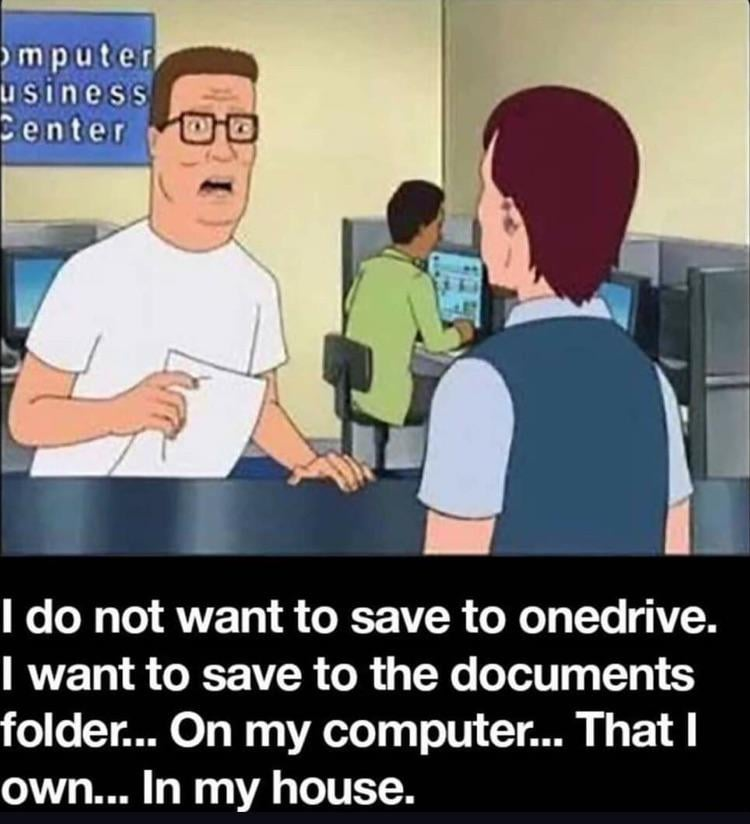

## What is local-first?

Not a new idea — the **old default**, rediscovered.

Before the cloud, software just **ran on your machine**: your files, your app, no internet
required. That was normal — until SaaS moved everything onto other people's servers, alongside
the ad networks and data brokers that profit from **capturing everything you do**.

The **cloud model** we know today: great collaboration and sync, but your data — and the app
itself — lives on *someone else's server*.

**Local-first** keeps the good parts of both:

- Your data lives on **your device**, first — the way it used to
- The network is a **sync + backup** detail, not the source of truth
- You *still* get cloud-style **collaboration**

---

{fig-align="center" height="560px"}

::: {.notes}
The punchline for "what is local-first": Hank Hill just wants to save to a folder on a computer
he owns, in his house — not OneDrive. That instinct *is* local-first, and it names the everyday
villain (forced cloud sync) that the rest of the talk pushes back on.
:::

---

## The 7 principles (1–4)

The essay lays out **seven ideals** for local-first software:

1. **No spinners — your work at your fingertips.** Reads and writes hit local data, so the app responds instantly.
2. **Your work is not trapped on one device.** It syncs to every device you own, so you start on your laptop and pick up on your phone without thinking about it.
3. **The network is optional.** You get full read/write access offline, and syncs when you reconnect — connectivity helps, but not required.
4. **Seamless collaboration with your colleagues.** Several people edit the same document at once and changes merge cleanly — the teamwork people expect from the cloud, without depending on it.

::: {.notes}
These four are the "day-to-day feel" principles — they're about the user experience:
fast, portable, offline-capable, and still collaborative. Read them as a checklist you
can hold any app up against.
:::

---

## The 7 principles (5–7)

5. **The Long Now.** The software should outlive the company and its servers: your files always open  .
6. **Security and privacy by default.** Your data stays with you and can be end-to-end encrypted, so no provider holds plaintext access to everything you do.
7. **You retain ultimate ownership and control.** The data is yours to keep, move, or delete, and no one can revoke your access or change the terms out from under you.

::: {.notes}
These three are the "values" principles — longevity, privacy, ownership. #5 (The Long Now)
is the one that resonates for anyone who's lost data to a shut-down SaaS product. This is
where local-first stops being a performance story and becomes a values story.
:::

---

## Major players

**Ink & Switch** — independent research lab that coined the term and does much of the
foundational work.

The 2019 essay's four authors:

- **Martin Kleppmann** — Cambridge researcher; wrote *Designing Data-Intensive Applications*
- **Peter van Hardenberg** ("PVH") — ran Heroku's Postgres / data team; now leads Ink & Switch
- **Adam Wiggins** — co-founded **Heroku**; wrote the **12-Factor App** methodology
- **Mark McGranaghan** — Heroku infrastructure engineer, author of *Go by Example*; later co-founded **Muse**

::: {.notes}
Kleppmann is the name most engineers recognize (DDIA is on a lot of desks). The Heroku thread
is the fun part and sets up the 12-Factor comparison later: PVH ran Heroku's Postgres fleet,
Adam Wiggins co-founded Heroku *and* wrote 12-Factor, Mark McGranaghan ran core infra there
(and made Go by Example). Wiggins + McGranaghan later built Muse together. There's now a real
community too — the annual Local-First Conf, which is what I attended.
:::

---

## Software that stands out

- **Figma** — multiplayer design, feels instant
- **tldraw** — collaborative whiteboard (a conf regular)
- **Obsidian** — your notes are just files on your disk

---

## 12-Factor ↔ Local-First

We've done **12-Factor** talks here — and Adam Wiggins wrote *both*. They pull in
opposite directions:

| 12-Factor (build for the cloud) | Local-First (own your data) |
|---------------------------------|-----------------------------|
| Processes are **stateless** (Factor VI) | State lives **on your device** (#2, #7) |
| Database is a remote **attached resource** (Factor IV) | The **network is optional** (#3) |
| App is tied to a **deploy** you run | App should **outlive** any deploy or company (#5) |
| The **server** is the source of truth | The **client** is the source of truth |

Same author, opposite end of the pendulum: 12-Factor optimized the **server**; local-first
re-centers the **client**.

::: {.notes}
The bridge back to our earlier 12-Factor sessions. Don't oversell it as a clean one-to-one
mapping — they answer different questions. 12-Factor is "how do I run a disposable cloud
server"; local-first is "where does the truth live, and who owns it." They even compose: a
local-first app's **sync backend can still be a textbook 12-Factor service**. The nice irony
is that the same Heroku crowd that codified stateless-cloud design later argued the client
should own its state.
:::

---

## Why it matters — and the tradeoffs

**Why it matters:**

- Works offline; fast because it's local
- Resilient — no single point of failure
- You **own** your data; it outlives the vendor

**The honest tradeoffs:**

- Sync + merge is **genuinely hard** engineering ⚠️
- **Schema migration** across old, offline clients ⚠️
- **Auth & permissions** without a central authority 🚫
- Search / discovery across distributed data 🚫

::: {.notes}
Important to be balanced — local-first is not free. The tradeoffs slide is what makes this
credible to an engineering audience: we've all felt how hard sync and migrations are. The
point isn't "always do this," it's "know the tool exists and what it costs."
:::

---

## Why this is interesting for SPD

- **We build tools, not engagement machines.** Local-first shines for focused tools and products — exactly what SPD ships — and its one "cost," no central usage surveillance, isn't a cost for us.
- **Ownership fits our users.** Inputs and analyses can stay on the user's machine, which sits well with partners handling sensitive or proprietary data.
- **Robustness as the default.** Fast, offline-tolerant tools that keep working without a live connection — and results that outlive any single deployment.

::: {.notes}
Tie it to what we actually do: we build decision and analysis tools, not ad-driven consumer
apps, so the local-first tradeoff curve runs in our favor — we gain speed, offline, and
ownership, and the thing we'd "give up" (harvesting user behavior) is something we don't want
anyway. The ownership angle matters for partners with sensitive data. Talking points, not a
mandate — this is "here's where it could fit," not "rewrite everything."
:::

---

## Local-first and agents

- **No gatekeeper between the agent and your work.** The data is local and open, so an LLM agent can read and edit it directly — no waiting on a central authority to approve an MCP server or cloud connector.
- **Agents collaborate like another peer.** The agent works on the same local copy you do, and the background sync merges your edits and the agent's cleanly — online or off.
- **Better tool interfaces → better agents.** If our tools expose clear local interfaces for an LLM to act through, the collaboration gets dramatically more useful.
- As tool builders, we can consider enabling these workflows

::: {.notes}
The non-obvious point: local-first and agents are natural partners. Wiring an agent into a SaaS
tool usually means an admin enabling a connector with central auth, and your data leaving your
control. With local-first, the document lives on your machine in an open format, so the agent
just operates on it directly — and merges the same way any other collaborator does. That's
exactly what the tldraw demo shows next.
:::
---

## Demo: tldraw

*(Live demo — placeholder)*

**tldraw** — an infinite collaborative whiteboard, local-first under the hood.

What I'll show: **me and an LLM agent editing the same canvas** — locally, in real time,
merging cleanly.

::: {.notes}
Placeholder for the live demo. The beat: I sketch on the tldraw canvas while an agent edits it
too — both operating on the same local document, changes merging with no central server. Makes
the previous slide (local-first + agents) concrete. Have a screen recording as backup in case
the wifi / demo gods misbehave. Keep it to ~3–4 minutes.
:::

---

## The enabling tech: CRDTs

The hard part is: how do independent copies of the data merge back together without a
central referee?

The answer most local-first tools reach for is **CRDTs** —
**Conflict-free Replicated Data Types**.

- Multiple devices edit their **own** copy, offline.
- When they reconnect, changes **merge automatically** — no server needed to arbitrate.
- Best-known implementations: **Automerge** (Ink & Switch) and **Yjs**.

You don't need the math today — just know this is the machinery that makes it work.

::: {.notes}
Keep this light — one slide. Contrast with the old approach (Operational Transformation,
what Google Docs uses) which generally needs a central server. CRDTs are designed for the
decentralized, offline-first case. Don't rabbit-hole on internals.
:::

---

## CRDTs feel like Git — without the merge conflicts

If you use **Git**, you already have most of the mental model:

| Git | Local-first / CRDTs |
|-----|---------------------|
| Everyone clones a **full local copy** | Every device holds a **full local copy** |
| Commit and work **offline** | Read and edit **offline**, anytime |
| `push` / `pull` / `merge` to sync up | Changes **sync and merge** in the background |
| Merge **conflicts** you fix by hand | Merges resolve **automatically**, by preset rules |

The key upgrade: a CRDT is built so concurrent edits **always merge cleanly** — no
`<<<<<<< HEAD` for the user to untangle.

::: {.notes}
Git already taught most engineers the hard part: distributed copies, offline work, merge-later.
The one thing you can't ship to end users is a merge conflict — nobody wants "resolve this
conflict" in their notes app. CRDTs trade Git's manual resolution for guaranteed automatic
merges. Caveat if asked: "automatic" means deterministic and conflict-free, not necessarily the
exact edit a human would have hand-picked.
:::

---

## Conf talk highlights (2026)

This year's theme: **"user empowerment in an age of fluid software"** — data ownership,
AI on your own terms, and open social protocols. A few that stood out:

- **Martin Kleppmann** — *Local-first in an unstable world*
- **Steve Ruiz** (tldraw) — *Agents on the canvas*
- **AI, on your device** — *Plaintext-first apps in the age of agents*; *Frontier LLM results, on device*; *Own your AI with local models*
- **Open networks & data ownership** — Paul Frazee (Bluesky) on scaling open networks; atproto; a panel on data ownership *beyond* local-first
- **Iroh** — syncing **terabytes** of data, peer-to-peer
- **A CRDT reality check** — *Local-first collaborative spreadsheets: are CRDTs useful?*

*(Placeholder — I'll dive into the specific talks that stuck with me next.)*

::: {.notes}
This is the seam between the background deck and my personal takeaways — swap in the talks I
actually want to feature. Note the 2026 shift: much less "can we even build this" and much
more AI-agents-on-device and open social protocols (Bluesky/atproto). Fun callback — Adam
Wiggins (Heroku / 12-Factor / local-first author) was the conference MC. Single-track, ~29
talks over two days plus a hands-on Lab Day.
:::

---

## Resources

- **Ink & Switch essay** — <https://www.inkandswitch.com/essay/local-first/>
- **Local-First Conf** — <https://www.localfirstconf.com/>
- **Community hub** — <https://localfirstweb.dev/>

::: {.notes}
The Ink & Switch essay is the single best starting point — send people there first. The
community hub (localfirstweb.dev) is the best "what tools exist now" map.
:::

---
